<div align="center">

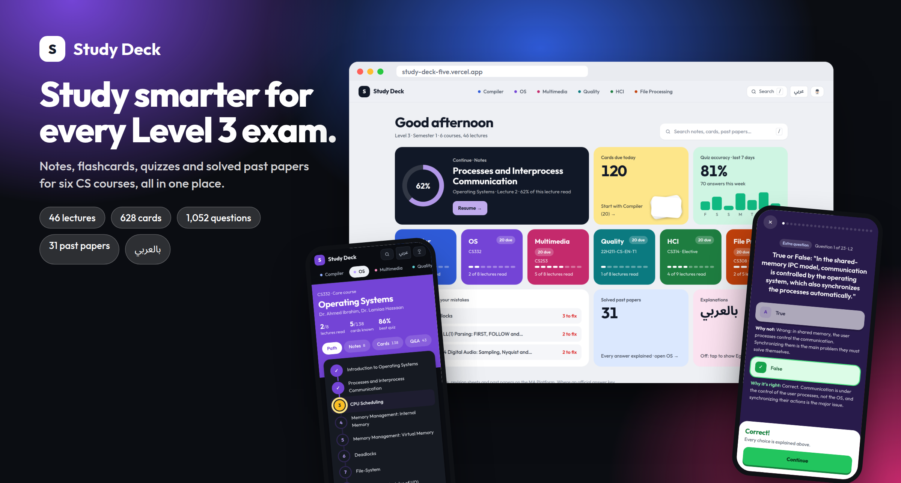

<h1>Study Deck</h1>

<p><b>One place to study every Level 3, Semester 1 Computer Science course.</b><br>
Notes, flashcards, Q&amp;A, quizzes with an explanation for every choice, and solved past papers, with Egyptian Arabic explanations when you need them.</p>

<p>
<a href="https://study-deck-five.vercel.app"></a>
</p>

<p>


</p>

<table>
<tr>
<td align="center"><h2>6</h2>courses</td>
<td align="center"><h2>46</h2>lectures</td>
<td align="center"><h2>628</h2>flashcards</td>
<td align="center"><h2>1,052</h2>quiz questions</td>
<td align="center"><h2>214</h2>Q&amp;A pairs</td>
<td align="center"><h2>31</h2>solved past papers</td>
</tr>
</table>

</div>

---

## ✨ Why it exists

Revising for six exams from scattered PDFs, slides and old papers is slow. Study Deck turns all of it into one fast site that knows what you have read, which cards are due and which questions you keep getting wrong. Then it shows you exactly what to do next.

- **Every answer is explained.** Each quiz choice says why it is right *or why it is wrong*, not just which letter is correct.
- **Professor's questions are kept apart from practice ones.** Past-exam, sheet and lecture questions are badged separately from the extra practice questions, so you know what the professor actually asked.
- **Arabic on demand.** One tap adds an Egyptian Arabic explanation under every note, card and answer. Technical terms stay in English, the way they are taught.
- **Your progress stays yours.** Everything is saved in your browser, with no account and no sign-up.

---

## 🏠 Home: everything at a glance

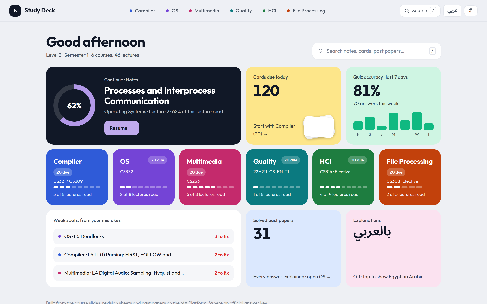

A bento dashboard that answers *"what should I study now?"*

| Tile | What it does |
|---|---|
| **Continue** | Jumps back to the exact lecture and scroll position you left, with a ring showing how far you got |
| **Cards due today** | Starts a spaced-repetition review in the course with the most cards due |
| **Quiz accuracy** | Your accuracy over the last 7 days, with a bar per day |
| **Course tiles** | One per course, showing lectures read and cards due |
| **Weak spots** | The lectures you make the most mistakes in. One tap retries just those questions |
| **بالعربي** | Turns the Arabic explanations on or off everywhere |

---

## 🗺️ Each course is a path

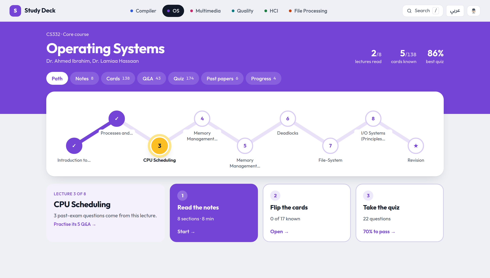

Lectures are stops on a route, ending in a **revision sheet** for the night before the exam. Pick a stop and follow three steps:

1. 📖 **Read the notes**: sectioned notes, tables, formulas and code, with a reading-progress bar
2. 🃏 **Flip the cards**: the lecture's flashcards, marked as known as you go
3. ✅ **Take the quiz**: 70% marks the stop as passed

The next step is highlighted, but nothing is ever locked, so you can jump anywhere. Q&A, past papers and a progress breakdown sit one tap away in the course tabs.

---

## 🎯 Focus mode for quizzes

<table>
<tr>
<td width="50%">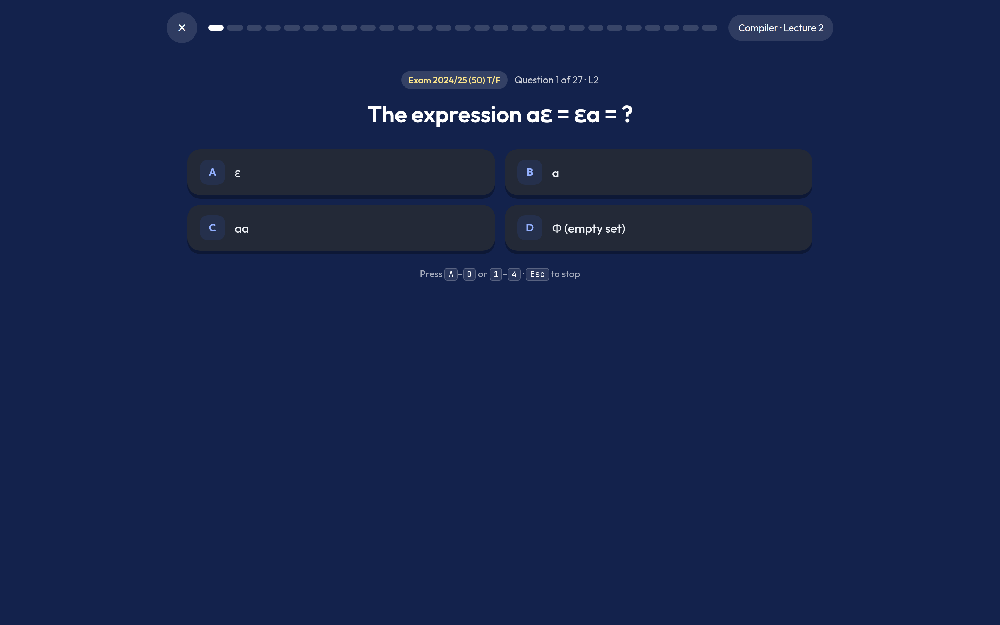</td>
<td width="50%">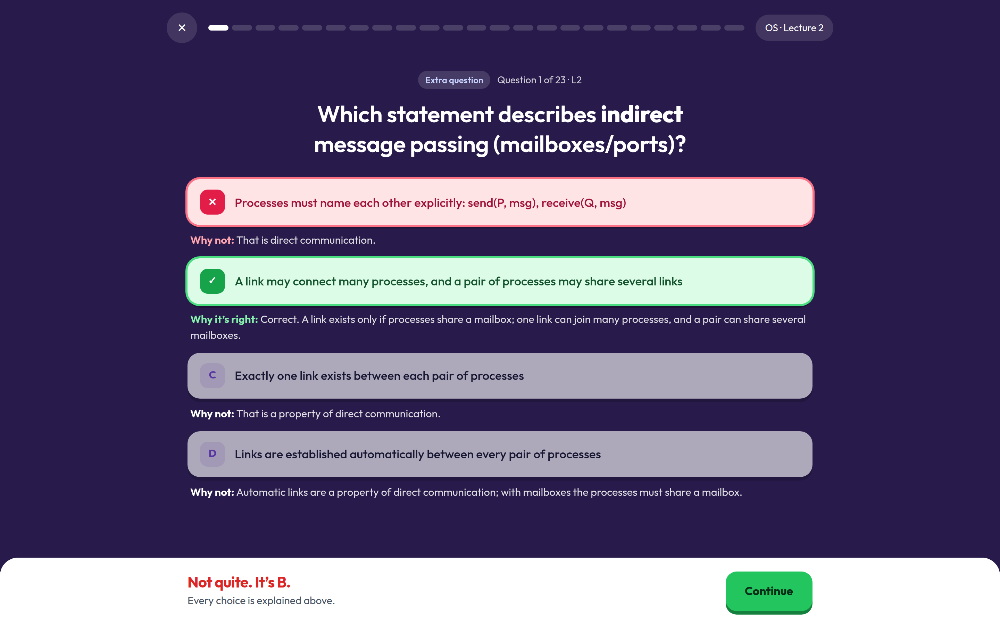</td>
</tr>
<tr>
<td align="center"><sub>One question, nothing else on screen</sub></td>
<td align="center"><sub>Every choice explained the moment you answer</sub></td>
</tr>
</table>

Quizzes open full screen with big answer tiles, keyboard shortcuts (<kbd>A</kbd>–<kbd>D</kbd> or <kbd>1</kbd>–<kbd>4</kbd>, <kbd>Enter</kbd> to continue) and a progress strip that fills green and red as you go. Wrong answers are saved to your mistakes automatically and come back in practice rounds until you get them right.

<table>
<tr>
<td width="50%">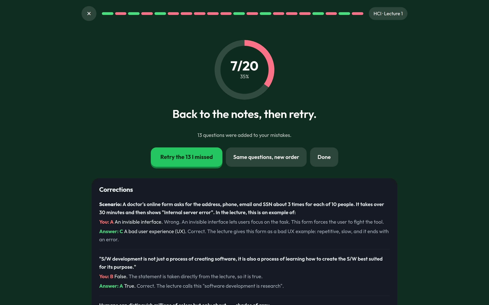</td>
<td width="50%">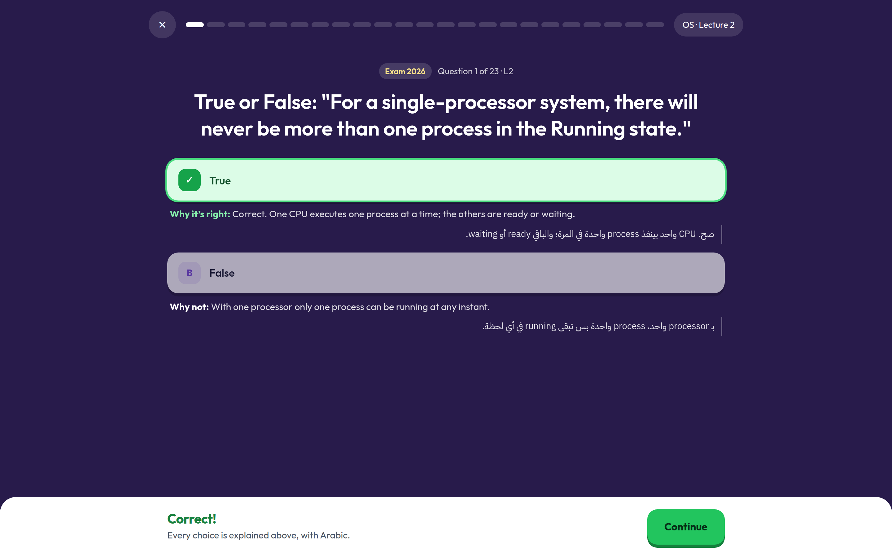</td>
</tr>
<tr>
<td align="center"><sub>Score, one-tap retry of the misses, and every correction</sub></td>
<td align="center"><sub>Arabic explanations under every choice</sub></td>
</tr>
</table>

There's also a **timed mock exam**: past-exam questions first, 1.5 minutes per question, flag and change answers, then hand in for full marking.

---

## 🃏 Flashcards with spaced repetition

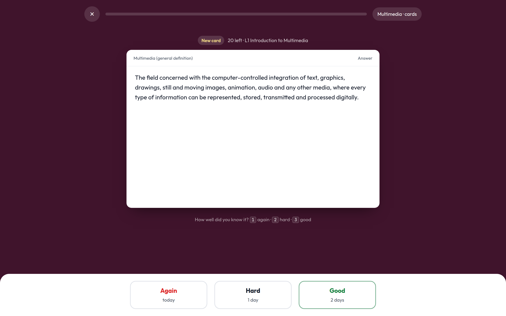

Rate each card **Again**, **Hard** or **Good**. A small SM-2-style scheduler brings it back in minutes, days or weeks, so you spend time on the cards you don't know yet. Up to 20 new cards are introduced per day per course. You can also browse every card by lecture, shuffle them and hide the ones you already know.

---

## 📚 Notes made for reading

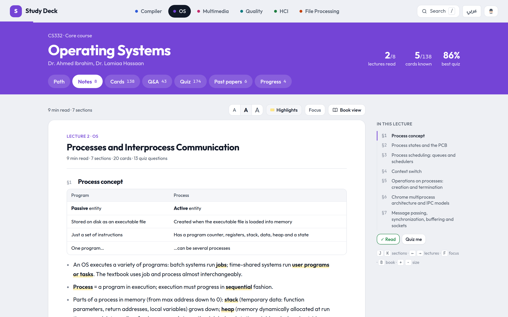

- Section outline that follows you as you scroll, plus <kbd>J</kbd>/<kbd>K</kbd> to jump between sections
- Highlighted key terms, three text sizes and a distraction-free focus mode
- **Book view**: read a lecture as a two-page book with a real page-turn animation and pinch-to-zoom
- Instant search across every course with <kbd>/</kbd> or <kbd>Ctrl</kbd>+<kbd>K</kbd>

---

## 🌗 Light, dark and every screen size

<table>
<tr>
<td width="62%">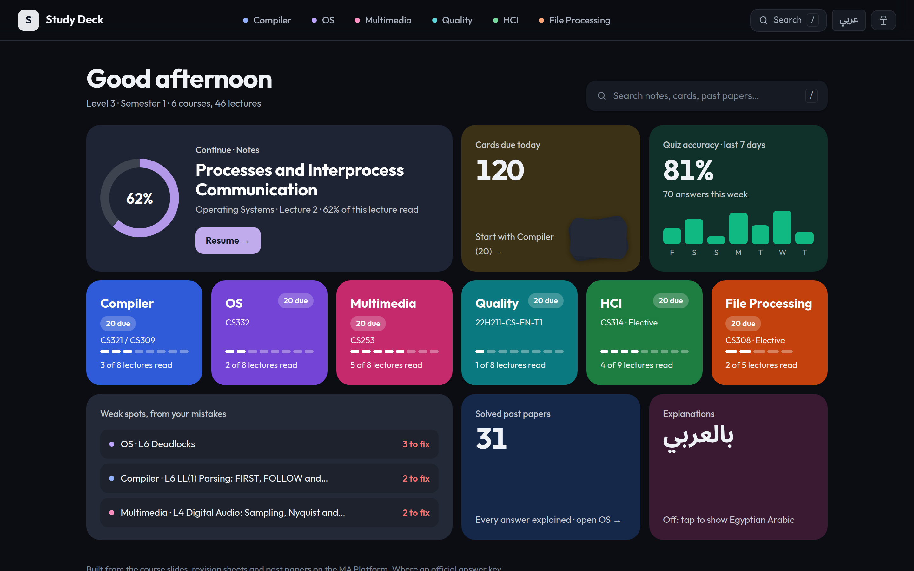</td>
<td width="12%">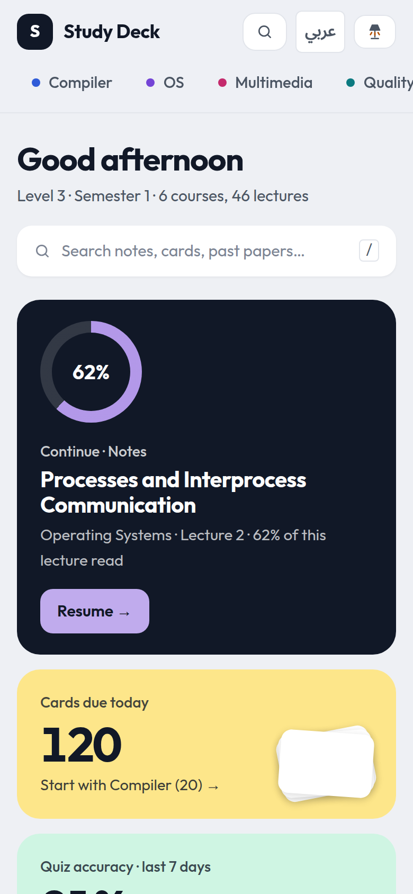</td>
<td width="12%">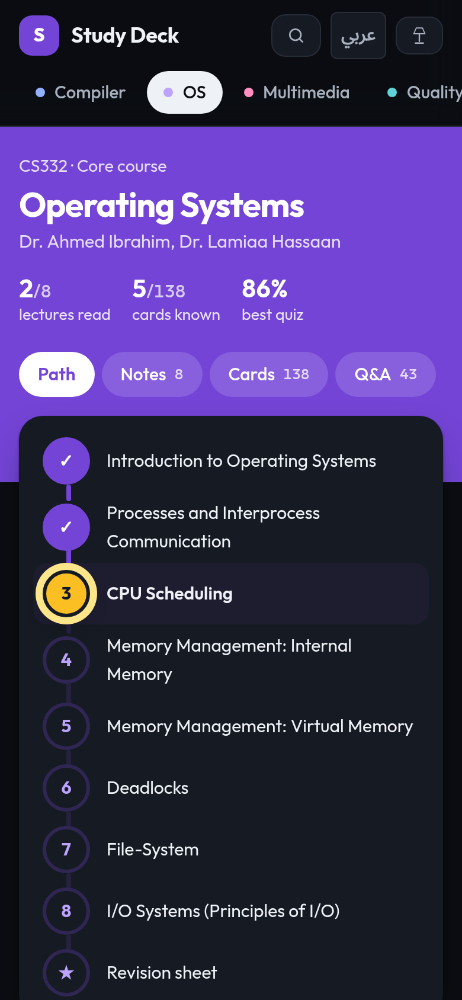</td>
<td width="12%">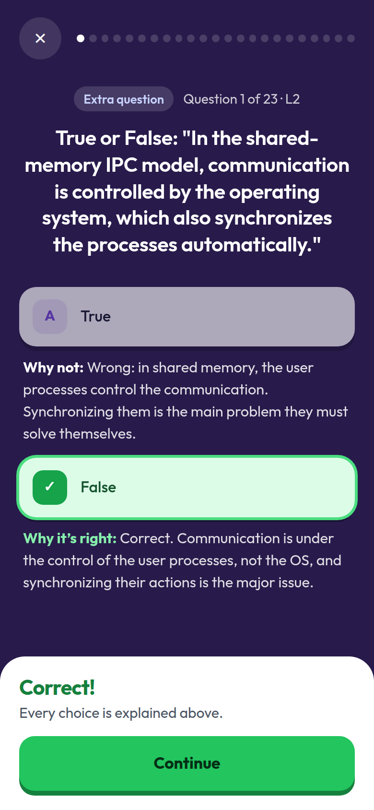</td>
</tr>
</table>

Follows your system theme or your own choice. Every screen is checked at phone, tablet and desktop widths in both themes: no sideways scrolling, no text smaller than 12&nbsp;px, and button contrast above WCAG AA.

---

## 📖 Courses

| Course | Code | Lectures | Cards | Questions | Past papers |
|---|---|:-:|:-:|:-:|:-:|
| 🔵 Compiler Design | CS321 / CS309 | 8 | 112 | 225 | 8 |
| 🟣 Operating Systems | CS332 | 8 | 138 | 174 | 6 |
| 🔴 Multimedia | CS253 | 8 | 118 | 216 | 10 |
| 🟢 Software Quality Assurance | 22H211-CS-EN-T1 | 8 | 116 | 171 | 2 |
| 🟩 Human Computer Interaction *(elective)* | CS314 | 9 | 78 | 166 | 2 |
| 🟠 File Processing *(elective)* | CS308 | 5 | 66 | 100 | 3 |

Where an official answer key disagrees with the lecture slides, both are shown and the conflict is flagged.

---

## ⚙️ How it's built

No framework build, no bundler, no `node_modules`. The whole app is static files.

- **React 18 + [htm](https://github.com/developit/htm)** from a CDN, so components are written as tagged templates and run straight in the browser, with a mirror fallback if a CDN is slow.
- **Lazy course data.** The first load is about 4&nbsp;KB of course names and counts; each course's data (and its Arabic layer) loads only when you open it, and the last course you studied is prefetched while the browser is idle.
- **Fast parsing.** Course data ships as `JSON.parse("…")`, which browsers parse faster than an equivalent object literal.
- **Smooth UI.** View Transitions for page changes, a circular reveal for the theme switch, a scroll listener that paints with `transform` only, and `content-visibility` on long lists.
- **Local-first progress.** Spaced-repetition state, answer history, mistakes, reading position and preferences live in `localStorage`.

```
study-deck/
├── index.html          # styles + page shell
├── app.js              # the whole React app
├── compiler.js … fp.js # editable course sources: notes, cards, Q&A, quiz, exams
├── extra/              # extra practice questions, per lecture
├── papers/             # more solved past papers, merged into the courses
├── ar/                 # Egyptian Arabic explanations, per course
├── build.mjs           # merges the sources into data/ + manifest.js
├── dist.mjs            # packages a standalone site into dist/
├── data/  manifest.js  # generated, loaded by the app
└── vercel.json         # Vercel runs build.mjs + dist.mjs and serves dist/
```

---

## 🚀 Run it locally

You only need Node.js 18 or newer.

```bash
git clone https://github.com/Marnie0/study-deck.git
cd study-deck
node build.mjs && node dist.mjs     # build data/ and the standalone dist/
npx serve dist                      # or: python3 -m http.server -d dist
```

### Add or fix content

Course content lives in plain JavaScript files. A quiz question looks like this:

```js
{
  q: "The process whose parent is terminated is called a(n) ________ process.",
  o: [
    ["zombie",   "A zombie has terminated itself but its parent has not yet called wait()."],
    ["orphan",   "Correct. If the parent terminated without invoking wait(), the process is an orphan."],
    ["main",     "Not a process state term."],
    ["renderer", "A Chrome process type."]
  ],
  a: 1,
  src: "Exam 2026"
}
```

Every option carries its own explanation, and `src` marks where the question came from (a past exam, the professor's sheet, a lecture example). Edit a course file, run `node build.mjs`, refresh, and the change is live. Pushing to `main` redeploys on Vercel.

---

## ⌨️ Keyboard shortcuts

| Where | Keys |
|---|---|
| Anywhere | <kbd>/</kbd> or <kbd>Ctrl</kbd>+<kbd>K</kbd> search |
| Notes | <kbd>J</kbd> <kbd>K</kbd> sections · <kbd>←</kbd> <kbd>→</kbd> lectures · <kbd>F</kbd> focus · <kbd>B</kbd> book view · <kbd>+</kbd> <kbd>−</kbd> text size |
| Quiz | <kbd>A</kbd>–<kbd>D</kbd> or <kbd>1</kbd>–<kbd>4</kbd> answer · <kbd>Enter</kbd> continue · <kbd>Esc</kbd> stop |
| Cards | <kbd>Space</kbd> flip · <kbd>1</kbd> <kbd>2</kbd> <kbd>3</kbd> rate · <kbd>←</kbd> <kbd>→</kbd> browse · <kbd>K</kbd> mark known |

---

## 🙏 Acknowledgements

Course content is summarised from the lectures, revision sheets and past papers of the Level 3, Semester 1 Computer Science courses at Modern Academy, shared on the MA Platform. Thanks to the course lecturers: Dr. Lamiaa Hassaan, Dr. Ahmed Ibrahim, Dr. Abbass Rostomme, Prof. Dr. Mahmoud Gadalla, Prof. Dr. Arabi Keshk, Dr. Mona Samir Lackousha and Dr. M. AbdelFattah.

This is an unofficial study aid made by a student. When in doubt, the lecture slides and your lecturers have the final word.

<div align="center">
<br>
<b>Good luck in the exams 🍀</b>
</div>
